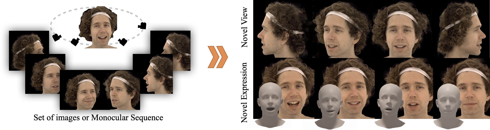

<p align="center">
  <h1 align="center">GAN-Avatar: Controllable Personalized GAN-based Human Head Avatar
 </h1>
 <p align="center">
    <a href="https://bernakabadayi.github.io/"><strong>Berna Kabadayi</strong></a>
    ·
    <a href="https://zielon.github.io/"><strong>Wojciech Zielonka</strong></a>
    ·
    <a href="https://virtualhumans.mpi-inf.mpg.de/people/Bhatnagar.html"><strong>Bharat Lal Bhatnagar</strong></a>
    .
    <a href="https://virtualhumans.mpi-inf.mpg.de/people/pons-moll.html"><strong>Gerard Pons-Moll</strong></a>
    .
    <a href="https://justusthies.github.io/"><strong>Justus Thies</strong></a>
  </p>
  <h2 align="center">International Conference on 3D Vision (3DV), 2024 </h2>
 
  <div align="center">
    
  </div>
</p> 

This is the Pytorch implementation of GAN-Avatar. More details please check our [project](https://ganavatar.github.io/) page.  

## Getting Started
Clone the repo 
  ```bash
  git clone https://github.com/bernakabadayi/ganavatar
  cd ganavatar
  ```  

Setup the submodules recursively
  ```bash
  mkdir eg3d
  git submodule update --init --recursive
  ```  

Ganavatar uses [eg3d](https://github.com/NVlabs/eg3d) for finetuning and its submodule Deep3DFaceRecon_pytorch for data processing. Please follow their instructions to setup it.

Following the [issue](https://github.com/NVlabs/eg3d/issues/67) from eg3d apply the following patch to fix triplane init.

  ```bash
git apply patch/eg3d.patch
  ```  

Download the pretrained eg3d model trained on ffhq and put inside ``` models/ ```   folder.

Finetunine eg3d with the following options.

```bash
conda activate eg3d

python eg3d/train.py --data=/wojtek_1gan --gpus=8 --batch=32 --cfg=ffhq --gamma=5 --snap=10 --outdir=training_runs_rebut --gen_pose_cond=False --neural_rendering_resolution_initial=128 --neural_rendering_resolution_final=128 --resume=/models/eg3d-fixed-triplanes-ffhq.pkl --metrics=none
```  

Generate frontal looking images for expression mapping network.
```bash
python gen_images_eg3d.py --args=/cfg/datagen/args_nf01_neck.yaml
```  

Ganavatar uses expression parameters to train mapping network. Expression parameters
from frontal images can be extracted as follows:

```bash
python scripts/preprocess_mapping.py --indir=/frontal/img
```  

Train mapping network
```bash
python lib/mapping_train.py --args ../cfg/mapnet/args_train_nf01_neck.yaml

```  

Test mapping network
```bash
python mapping_test.py --args ../../cfg/maptest/args_test_nf01_neck.yaml
```  

## Run Ganavatar on your dataset

Sample dataset and appearance model training json can be found [here](https://drive.google.com/drive/folders/1pasgYh5PsJXcoVz7UMGyt2THMyFyxx7c?usp=sharing).

We provide scripts to process [INSTA](https://github.com/Zielon/INSTA) actors for Ganavatar training.

Your tracked mesh (i.e., FLAME) should align with [eg3d marching cube result](../ganavatarelease/dataset/seed_no_indexing_flipped0081_norma_fixed.ply), located in ```models/```. After obtaining transformation matrix, run ```insta2ganavatar.py ```


```bash
python scripts/insta2ganavatar.py
``` 

## Pretrained models

If you need the pretrained models, please contact [berna.kabadayi@tue.mpg.de](berna.kabadayi@tue.mpg.de)

## Citation

Cite us if you find this repository is helpful to your project:


```bibtex
@misc{kabadayi2023ganavatar,
      title={GAN-Avatar: Controllable Personalized GAN-based Human Head Avatar}, 
      author={Berna Kabadayi and Wojciech Zielonka and Bharat Lal Bhatnagar and Gerard Pons-Moll and Justus Thies},
      year={2023},
      eprint={2311.13655},
      archivePrefix={arXiv},
      primaryClass={cs.CV}
}
```
## Acknowledgments 
Here are some great resources we benefit from:
- [EG3D](https://github.com/NVlabs/eg3d) for finetuning our person-specific generative model
- [INSTA](https://github.com/Zielon/INSTA) actors for training
- [MICA](https://github.com/Zielon/MICA) metrical tracker to obtain FLAME mesh and camera params
- [Multiface](https://github.com/facebookresearch/multiface) actors for multiview experiments
- [RobustVideoMatting](https://github.com/PeterL1n/RobustVideoMatting) for background segmentation
- [Deep3DFaceRecon_pytorch](https://github.com/sicxu/Deep3DFaceRecon_pytorch) to extract expression parameters  
- [PyTorch3D](https://github.com/facebookresearch/pytorch3d)
- [Nerface](https://github.com/gafniguy/4D-Facial-Avatars) actors


## License

This code and model are available for non-commercial scientific research purposes as defined in the [LICENSE](LICENSE) file. By downloading and using the code and model you agree to the terms in the [LICENSE](LICENSE). Please also check eg3d license.
